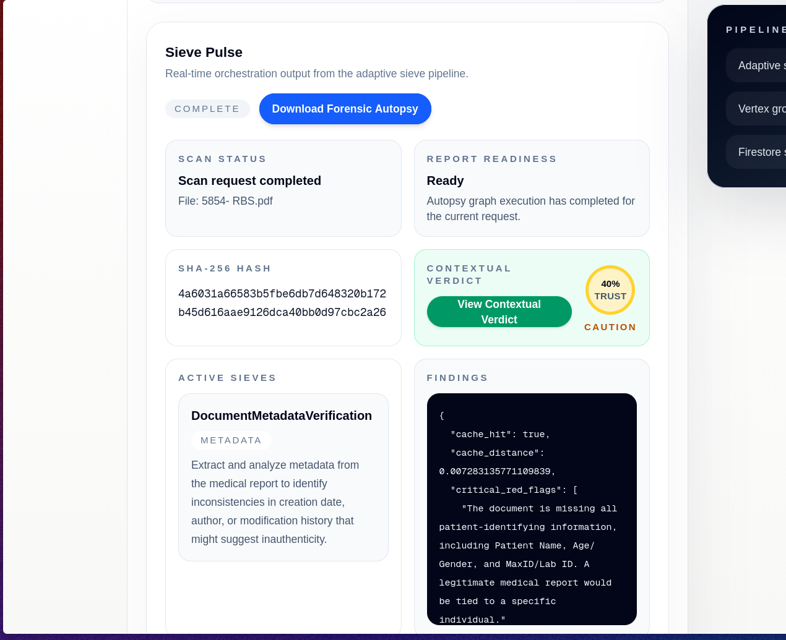
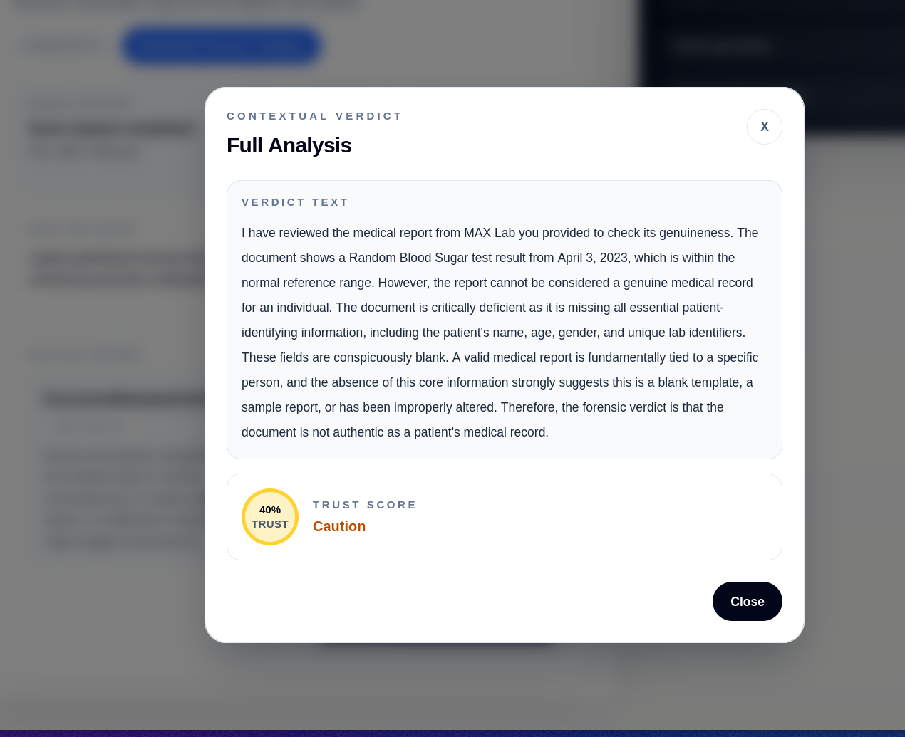
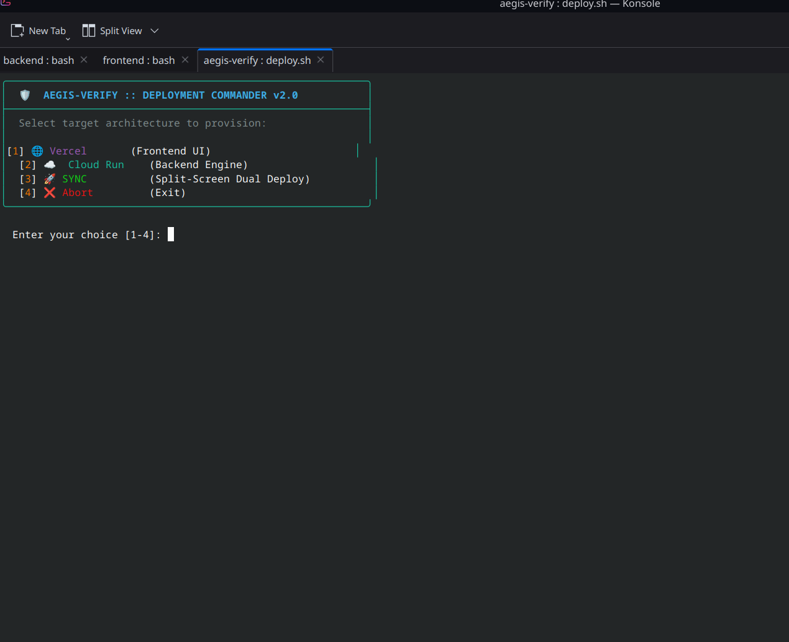
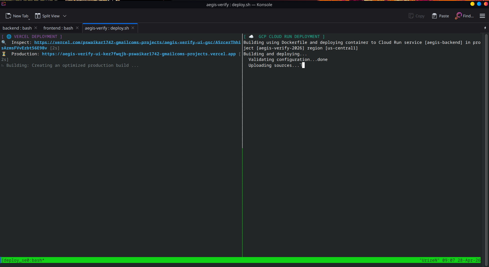

# 🛡️ Aegis-Verify — Forensic Autopsy Pipeline

> **Domain-Aware, Autonomous Digital Asset Forensics Engine**  
> Built for the **Google Solution Challenge 2026** · Powered by **Vertex AI + LangGraph + Firestore**

[](./backend)
[](./frontend)
[](https://cloud.google.com/vertex-ai)
[](./deploy.sh)

---

## The Problem — The Visibility Gap & Alert Fatigue

The proliferation of Generative AI has eroded digital trust. Enterprises, media organizations, and legal institutions face an unprecedented volume of sophisticated digital manipulation — deepfakes, forged contracts, synthetic media. Current detection approaches suffer from three fatal flaws:

- **Probabilistic "Black Boxes":** Generic likelihood scores without explainable proof are inadequate for legal or high-stakes audit contexts.
- **Alert Fatigue:** Uncontextualized anomaly flags overwhelm security teams, increasing the chance true threats are ignored.
- **Static Rigidity:** Rule-based detectors cannot dynamically adapt to novel document types or domains.

---

## Our Solution — Aegis-Verify

Instead of a single "trust score," Aegis-Verify produces a **Cryptographic Forensic Autopsy Report**: a human- and legally-readable artifact that records every test performed, all deterministic proofs (SHA-256 hashes, metadata), and LLM-guided findings.

### 🧠 1. Context-Aware Sieve Generation (Domain-Aware Routing)
**The Concept:** Security isn't one-size-fits-all. A medical invoice requires entirely different forensic validation than a corporate NDA.
**The Pitch:** "Instead of relying on rigid, static rulesets, Aegis-Verify utilizes Gemini 2.5 Pro as a Cognitive Router. By semantically analyzing the user’s investigative prompt and the asset's underlying data structure, the engine instantly maps the specific domain. It understands exactly what it is looking at, prioritizing semantic logic checks for legal documents or deep-pixel visual analysis for photographic evidence."

### ⚡ 2. Real-Time Sieve Generation (Zero-Shot Ephemeral Sieves)
**The Concept:** If the system encounters a completely new type of document, it doesn't fail—it invents a new tool on the fly.
**The Pitch:** "When confronted with a novel threat vector or a previously unseen document type, Aegis-Verify deploys a Zero-Shot Ephemeral Sieve Architecture. It autonomously forges custom forensic heuristics at runtime. If an analyst uploads an unprecedented asset, the system dynamically writes the exact forensic logic required to audit it. It acts as an adapting, real-time digital immune system."

### 🧬 3. Self-Learning Through Memory (The Recursive Sieve Vault)
**The Concept:** We save the dynamically generated sieves in a vector database. The next time a similar document is uploaded, execution is instant.
**The Pitch:** "Aegis-Verify possesses an Autonomous Immune Memory powered by Google Cloud Firestore's Native Vector Search. Once a custom sieve is forged, its mathematical embedding is cached offline. When a similar threat context is ingested in the future, the system bypasses the LLM generation phase entirely (a 'Cache Hit'). This instantly retrieves the verified forensic logic, dramatically reducing LLM latency and drastically cutting cloud compute costs."

### 🛡️ 4. Admin Approval & Governance (Human-in-the-Loop Quarantine)
**The Concept:** AI shouldn't permanently rewrite global security rules without a human expert saying "Yes."
**The Pitch:** "Enterprise security demands strict governance. Newly forged AI sieves are initially saved in a 'Quarantine State' (pending verification). Through an administrative pipeline, a human CISO can review the AI-generated forensic rules. Once approved, the ephemeral sieve is promoted to the permanent global ruleset. This ensures continuous, autonomous system hardening while maintaining uncompromising Human-in-the-Loop (HITL) oversight."

---

## 🛡️ The Aegis-Verify USPs (Unique Selling Propositions)

1. **The "Zero-Day" Immunity (Ephemeral Sieve Architecture)**
   - **The Problem:** Traditional cybersecurity and forensic tools rely on static, pre-programmed rulesets. When a new type of fraud emerges (a "zero-day" forgery), the system is blind until developers patch it.
   - **The USP:** Aegis-Verify uses a Zero-Shot Ephemeral Sieve Architecture. It doesn’t rely on a dropdown menu of tests; it uses Gemini 2.5 Pro to invent custom forensic tests (Sieves) on the fly, perfectly tailored to whatever unprecedented asset is uploaded. It adapts in real-time.

2. **Autonomous Immune Memory (Vector-Driven Cost Reduction)**
   - **The Problem:** Agentic AI is usually too slow and too expensive for enterprise scale because it generates everything from scratch every single time.
   - **The USP:** Aegis-Verify has Amnesia-Free AI. By caching generated sieves into Google Cloud Firestore's Vector Database, the system "remembers" past document types. A cache-hit bypasses the LLM generation phase entirely, dropping processing latency from 15 seconds to 0.2 seconds and drastically cutting API cloud compute costs. It gets faster and cheaper the more you use it.

3. **Semantic Forgery Detection (Catching the "Lie", not just the Pixel)**
   - **The Problem:** Standard tools only scan for visual deepfakes (pixel blending, noise drift) or metadata (EXIF). Advanced forgers can easily bypass this by keeping the visual authentic but altering the text context.
   - **The USP:** Aegis-Verify deploys a Semantic Sieve. It doesn't just scan the document; it reads the document using Gemini's massive context window. It detects temporal impossibilities (e.g., dates that contradict each other), legal inconsistencies, and generative AI text signatures within official documents. We don't just catch bad Photoshop; we catch the lie.

4. **"Explainability-First" Output (The Legal-Grade Autopsy)**
   - **The Problem:** Enterprise CISOs and lawyers cannot take action on a "black-box" AI tool that just spits out a "95% Fake" score. They need proof.
   - **The USP:** Aegis-Verify guarantees deterministic explainability. It outputs a downloadable, printable Forensic Autopsy PDF detailing the exact chain of custody (SHA-256 Hash), the specific sieves used, and a conversational breakdown of the exact anomalies found. Probabilistic AI guesses; Aegis-Verify proves.

5. **100% Google Cloud-Native Scalability**
   - **The Problem:** Heavy machine learning models require expensive, idle GPU servers to maintain uptime.
   - **The USP:** Built specifically for the Google ecosystem, Aegis-Verify is entirely serverless. The LangGraph orchestration runs on Google Cloud Run, meaning it scales to 0 when idle (costing nothing) and can instantly spin up 1,000 containers to process a massive influx of documents during an enterprise audit.

---

## System Architecture


The architecture follows a strict **Google-Native** stack: the Next.js CISO Cockpit calls the FastAPI backend (Cloud Run), which hands off to the LangGraph StateGraph. The graph's Memory Router checks Firestore's Native Vector Search — on a cache hit it retrieves proven sieves in sub-second; on a miss it calls Gemini 2.5 Flash to forge new sieves, then invokes Gemini 2.5 Pro to execute the full forensic analysis.

### Component Overview

```
Browser (CISO Cockpit)
    └── POST /api/v1/scan (multipart: file + user_prompt)
            └── FastAPI [Cloud Run · Python 3.11 · PORT 8080]
                    └── LangGraph StateGraph
                            ├── memory_router_node → Vertex AI text-embedding-004 + Firestore vector search
                            ├── sieve_forge_node   → Gemini 2.5 Flash (cache miss path)
                            └── executor_node      → Gemini 2.5 Pro multimodal (all paths)
                                    └── findings JSON → Dashboard + @react-pdf/renderer PDF
```

---

## Forensic Pipeline — Data Flow


### Step-by-Step Flow

1. **Evidence Ingest** — User drags & drops a file (PDF/image) and supplies a context prompt
2. **SHA-256 Hash** — Client-side WebCrypto API computes the cryptographic fingerprint (immutability proof)
3. **Prompt Embedding** — `text-embedding-004` vectorizes the user prompt into a `list[float]`
4. **Firestore Vector Search** — Cosine similarity query on the `ephemeral_sieves` collection
5. **Branch Decision:**
   - **Cache Hit** (similarity > 0.85): retrieve pre-verified sieves from the Recursive Sieve Vault (sub-second, zero LLM cost)
   - **Cache Miss** (similarity ≤ 0.85): Gemini 2.5 Flash forges 2–3 custom `DynamicSieve` objects and persists them
6. **Executor Node** — Gemini 2.5 Pro runs multimodal forensic analysis using the active sieves
7. **Findings Compilation** — LangGraph Governor merges `critical_red_flags`, `missing_metadata`, `contextual_verdict`
8. **Dashboard + PDF** — Trust Score badge rendered; `@react-pdf/renderer` generates the Forensic Autopsy PDF

---

## LangGraph State Machine


```python
# AutopsyState — the typed contract flowing through every LangGraph node
class AutopsyState(TypedDict):
    file_bytes: bytes
    mime_type: str
    user_prompt: str
    prompt_embedding: list[float]
    active_sieves: list[DynamicSieve]   # forged or retrieved
    findings: dict[str, Any]            # merged across nodes
    autopsy_report_ready: bool

# DynamicSieve — the forensic test unit
class DynamicSieve(TypedDict):
    sieve_name: str
    objective: str
    required_tool: str  # "vision" | "osint_grounding" | "metadata"
```

**Graph edges:**
```
START → memory_router_node
memory_router_node → executor_node      [cache_hit = True]
memory_router_node → sieve_forge_node   [cache_hit = False]
sieve_forge_node   → executor_node
executor_node      → END
```

---

## Live Screenshots

### CISO Dashboard — Sieve Pulse & Results

The CISO Dashboard displays real-time forensic analysis output, including active sieves, SHA-256 hash, contextual verdict with Trust Score badge, and the findings JSON panel.



> **Sieve Pulse Panel** — shows `SCAN STATUS`, `REPORT READINESS`, `SHA-256 HASH`, `CONTEXTUAL VERDICT` with Trust Score, `ACTIVE SIEVES`, and raw `FINDINGS` JSON.

**Trust Score Levels:**

| Score | Level | Condition |
|---|---|---|
| 100% ✅ | **Clean** | Zero red flags detected |
| 75% 🟡 | **Mostly Safe** | <1 flag per sieve on average |
| 55% 🟠 | **Caution** | 1–2 flags per sieve |
| 25% 🔴 | **Suspicious** | >2 flags per sieve |

### Contextual Verdict Modal

The **Full Analysis** modal surfaces the complete `contextual_verdict` string from Gemini 2.5 Pro — a natural-language forensic narrative that directly addresses the user's original prompt, followed by the final verdict and Trust Score.



*Example output for a medical report:*
> "I have reviewed the medical report from MAX Lab you provided to check its genuineness. The document shows a Random Blood Sugar test result from April 3, 2023... The document is critically deficient as it is missing all essential patient-identifying information... Therefore, the forensic verdict is that the document is not authentic as a patient's medical record."
> **Trust Score: 40% — CAUTION**

---

## Deployment Commander v2.0

The `deploy.sh` script provides an interactive btop-style TUI for deploying both services.



```
╭──────────────────────────────────────────────────────────╮
│  🛡️  AEGIS-VERIFY :: DEPLOYMENT COMMANDER v2.0           │
├──────────────────────────────────────────────────────────┤
│  Select target architecture to provision:                │
│                                                          │
│[1] 🌐 Vercel       (Frontend UI)                         │
│  [2] ☁️  Cloud Run    (Backend Engine)                    │
│  [3] 🚀 SYNC          (Split-Screen Dual Deploy)          │
│  [4] ❌ Abort         (Exit)                              │
╰──────────────────────────────────────────────────────────╯
```

**Option 3 — SYNC** launches a tmux split-screen session running Vercel and Cloud Run deployments simultaneously in side-by-side panes. Falls back to parallel background processes with colored prefixes if tmux is unavailable.

### Deployment Targets

| Option | Service | Command |
|---|---|---|
| `[1]` Vercel | Frontend (Next.js) | `npx vercel --prod --yes` |
| `[2]` Cloud Run | Backend (FastAPI) | `gcloud run deploy aegis-backend --source . --region us-central1` |
| `[3]` SYNC | Both simultaneously | tmux split-screen, left pane = Vercel, right pane = Cloud Run |

### Live Deployment

Both services deploy simultaneously in a tmux split:
- **Left pane `[ 🌐 VERCEL DEPLOYMENT ]`**: Next.js build → Vercel production URL
- **Right pane `[ ☁️ GCP CLOUD RUN DEPLOYMENT ]`**: Docker build → Cloud Run service `aegis-backend`



**Deployed URLs:**
- **Frontend:** `https://aegis-verify-ui-kez7fwqjb-pswaikar1742-gmailcoms-projects.vercel.app`
- **Backend:** `https://aegis-backend-*.run.app` (Cloud Run, `us-central1`)

---

## Quick Start (Local Development)

### Prerequisites

- Python 3.11+ with virtualenv
- Node.js 18+ / npm 9+
- Google Cloud credentials with Vertex AI + Firestore permissions
- GCP project with `GCP_PROJECT_ID=aegis-verify-2026`

### Backend (FastAPI)

```bash
cd backend
python -m venv venv && source venv/bin/activate
pip install -r requirements.txt

# Set environment variables
export GCP_PROJECT_ID="aegis-verify-2026"
export GCP_REGION="us-central1"
export CORS_ORIGINS='["http://localhost:3000"]'

# Run dev server
uvicorn main:app --reload --host 0.0.0.0 --port 8000
```

Or via `.env` file (see `backend/.env`):
```env
GCP_PROJECT_ID="aegis-verify-2026"
GCP_REGION="us-central1"
CORS_ORIGINS='["http://localhost:3000"]'
```

### Frontend (Next.js)

```bash
cd frontend
npm install
npm run dev
# Open http://localhost:3000
```

> **Note:** The frontend hardcodes `http://localhost:8000/api/v1/scan` for local development. Update this to the Cloud Run URL for production.

### One-Command Deploy

```bash
chmod +x deploy.sh
./deploy.sh
# Select [3] SYNC for simultaneous Vercel + Cloud Run deployment
```

---

## API Reference

### `POST /api/v1/scan`

Accepts multipart form data. Runs the full LangGraph autopsy pipeline.

**Request:**
```bash
curl -X POST "http://localhost:8000/api/v1/scan" \
  -F "file=@/path/to/evidence.pdf" \
  -F "user_prompt=Audit this medical report for authenticity and missing patient data"
```

**Response:**
```json
{
  "status": "success",
  "message": "Scan request completed",
  "filename": "evidence.pdf",
  "autopsy_report_ready": true,
  "active_sieves": [
    {
      "sieve_name": "DocumentMetadataVerification",
      "objective": "Extract and analyze metadata from the medical report to identify inconsistencies in creation date, author, or modification history that might suggest inauthenticity.",
      "required_tool": "metadata"
    }
  ],
  "findings": {
    "cache_hit": true,
    "cache_distance": 0.007283135771109839,
    "critical_red_flags": ["The document is missing all patient-identifying information..."],
    "missing_metadata": ["Patient Name", "Age/Gender", "MaxID/Lab ID"],
    "contextual_verdict": "I have reviewed the medical report...",
    "executor_status": "completed"
  }
}
```

**Key findings fields:**

| Field | Type | Description |
|---|---|---|
| `cache_hit` | bool | Whether sieves were retrieved from Firestore (vs. freshly forged) |
| `cache_distance` | float | Cosine distance from nearest cached embedding (lower = closer match) |
| `critical_red_flags` | `string[]` | Forensic anomalies detected by the active sieves |
| `missing_metadata` | `string[]` | Required fields absent from the document |
| `contextual_verdict` | string | Gemini 2.5 Pro narrative verdict addressing the user's prompt |
| `executor_status` | string | `"completed"` or `"failed"` |

---

## Technology Stack

### Frontend — CISO Cockpit

| Technology | Version | Role |
|---|---|---|
| Next.js | 16.2.4 | App Router, SSR, routing |
| React | 19.2.4 | UI framework |
| TypeScript | 5.x | Type safety |
| Tailwind CSS | 4.x | Utility-first styling |
| `@react-pdf/renderer` | 4.5.1 | On-demand Forensic Autopsy PDF generation |
| `react-dropzone` | 15.x | Drag-and-drop evidence intake |
| WebCrypto API | native | SHA-256 client-side hashing |

### Backend — Intelligence Engine

| Technology | Version | Role |
|---|---|---|
| Python | 3.11+ | Runtime |
| FastAPI | 0.115.0 | REST API, CORS middleware |
| LangGraph | 1.0.10 | StateGraph orchestration |
| Pydantic | 2.12.5 | Settings, validation |
| uvicorn | 0.30.6 | ASGI server |
| Docker | python:3.11 | Containerization for Cloud Run |

### AI & Memory — Google-Native

| Service | Model / Version | Role |
|---|---|---|
| Vertex AI | Gemini 2.5 Pro | Multimodal forensic executor (`execute_forensic_sieves`) |
| Vertex AI | Gemini 2.5 Flash | Ephemeral sieve forging (`sieve_forge_node`) |
| Vertex AI | `text-embedding-004` | Prompt vectorization for cache lookup |
| Vertex AI | Google Search Grounding | Live OSINT retrieval (prepared, SDK-guarded) |
| Firestore | Native Vector Search | Recursive Sieve Vault — `ephemeral_sieves` collection |

### Infrastructure

| Service | Role |
|---|---|
| Vercel | Frontend hosting (Next.js production build) |
| Google Cloud Run | Backend hosting (auto-scales 0→N, 1Gi memory) |
| Google Artifact Registry | Docker image storage (via `gcloud run deploy --source`) |

---

## Project Structure

```
aegis-verify/
│
├── frontend/                          # Next.js CISO Cockpit
│   ├── app/
│   │   ├── layout.tsx                 # Root layout (Geist fonts)
│   │   ├── page.tsx                   # CISO Dashboard (drag-drop, trust score, findings)
│   │   └── globals.css                # Tailwind CSS v4 + CSS variables
│   ├── components/
│   │   └── AutopsyReport.tsx          # PDF generation (@react-pdf/renderer)
│   └── package.json                   # next 16, react 19, @react-pdf/renderer 4.5.1
│
├── backend/                           # FastAPI + LangGraph
│   ├── main.py                        # POST /api/v1/scan endpoint + CORS
│   ├── core/
│   │   ├── config.py                  # Pydantic BaseSettings (fail-fast)
│   │   └── graph.py                   # LangGraph StateGraph (3 nodes)
│   ├── services/
│   │   ├── vertex_llm.py              # VertexLLMService (Gemini 2.5 Pro/Flash)
│   │   └── firestore_db.py            # FirestoreSieveStore (vector search + save)
│   ├── Dockerfile                     # python:3.11, PORT 8080
│   └── requirements.txt               # fastapi, langgraph, google-cloud-*
│
├── docs/                              # Architecture diagrams & screenshots
│   ├── system_architecture.png
│   ├── forensic_pipeline.png
│   └── langgraph_state_machine.png
│
├── deploy.sh                          # Deployment Commander v2.0 (Vercel + Cloud Run)
├── README.md                          # This file
├── architecture.md                    # Tech stack & state machine reference
├── context.md                         # Mission context & constraints
├── current_code.md                    # Full code snapshot (gitignored)
└── logs.md                            # Development work log (gitignored)
```

---

## Environment & Secrets

```bash
# backend/.env (not tracked by git)
GCP_PROJECT_ID="aegis-verify-2026"
GCP_REGION="us-central1"
CORS_ORIGINS='["http://localhost:3000"]'
```

- `GOOGLE_APPLICATION_CREDENTIALS` — path to GCP service account JSON (for local dev)
- `GCP_PROJECT_ID` — GCP project for Vertex AI + Firestore
- `GCP_REGION` — defaults to `us-central1`
- `CORS_ORIGINS` — comma-separated list of allowed origins

For Cloud Run, env vars are injected via `--set-env-vars` in `deploy.sh`.

---

## Use Cases

### Insurance Fraud Detection
Upload a crash photo with prompt *"Verify this insurance claim for location inconsistency"*. The system generates Geolocation and EXIF Camera Metadata sieves, extracts hidden GPS coordinates, and proves the photo location is inconsistent with the claimed accident site.

### Corporate Document Fraud
Upload a vendor invoice with prompt *"Verify vendor legitimacy"*. System constructs OSINT sieves, uses Vertex Grounding to check domain registration and corporate records, and flags shell companies or recently-registered domains.

### Medical Report Verification
Upload a medical PDF with prompt *"Check this report for authenticity"*. The DocumentMetadataVerification sieve extracts metadata, flags missing patient-identifying fields, and delivers a 40% Trust Score — **CAUTION**.

---

## 💼 The Hybrid Business Model

**The Strategy:** A three-tiered hybrid approach combining Product-Led Growth (PLG) for developers with Enterprise-grade deployments for banks, insurance agencies, and law firms.

### Tier 1: The Developer "Open-Core" (Bring-Your-Own-Cloud)
- **Target:** Security researchers, independent journalists, and startup developers.
- **The Model:** Free to use. Users clone the Aegis-Verify Next.js/FastAPI codebase but must plug in their own Google Cloud Project ID and Vertex AI billing account.
- **Why it works:** You pay $0 in server costs for free users. It drives massive developer adoption and acts as a massive lead-generation engine. Google loves this because you are driving organic compute traffic to GCP.

### Tier 2: Managed Cloud SaaS (Pay-Per-Autopsy)
- **Target:** Mid-market law firms, HR departments, and local insurance agencies.
- **The Model:** A fully hosted, turn-key web platform. Users pay a subscription fee + a metered cost per document scanned (e.g., $0.15 per Autopsy Report).
- **Why it works:** High-margin revenue. You leverage Google Cloud Run's serverless auto-scaling to keep your overhead near zero when traffic is low, ensuring you only pay Google when your clients pay you.

### Tier 3: Enterprise VPC Deployment (The Big Ticket)
- **Target:** Global Banks, Healthcare Networks, and Government Entities.
- **The Model:** Custom enterprise contracts ($50k - $100k/year). For highly regulated industries with strict data residency laws (GDPR, HIPAA, SOC2), Aegis-Verify is deployed directly inside the client's own private Google Cloud infrastructure (VPC).
- **Why it works:** This includes the exclusive Admin Governance Dashboard (allowing CISOs to manually approve/quarantine new sieves). This tier locks in massive B2B contracts.

---

## 💼 Premium Enterprise Add-On: "Custom Sieve Vaults & Industry Packs"

*Add this right below your Tier 3 Enterprise model. This is where you make the real money.*

**The Concept:** While the Ephemeral Sieve Forge generates rules on the fly for unknown documents, enterprises process millions of known documents (Passports, Claims, W-2s). We offer them **Custom Sieve Vaults**—pre-compiled, highly optimized, industry-specific forensic pipelines.

**The Offerings:**
1. **Industry-Specific "Sieve Packs" (Subscription Add-Ons):**
   - **The KYC/AML Pack:** Pre-loaded sieves specifically built to verify Passports, State IDs, and Utility Bills (checking MRZ codes, holographic watermarks, and typography alignment).
   - **The InsurTech Pack:** Specialized sieves for vehicle collision photos (checking metadata timestamp vs. shadow angles, and reverse-image searching the crash against global news databases).
   - **The FinTech Pack:** Bank statement and W-2 sieves (mathematical reconciliation of tax brackets, detecting splicing in PDF routing numbers).

2. **The "Sieve Studio" SDK (Enterprise Customization):**
   - Instead of Aegis-Verify writing the rules, we provide an SDK/Dashboard where the client's own internal compliance officers can hardcode their own proprietary Sieves.
   - *Example:* A proprietary trading firm can write a Sieve that strictly scans for their internal watermarks.

**The Monetization Strategy:**
- Clients pay a premium annual licensing fee to unlock these specialized "Sieve Packs."
- If a bank wants a custom Sieve built specifically for their internal, highly classified document types, Aegis-Verify offers "Sieve-as-a-Service" consulting, charging high-ticket professional service fees to build, train, and deploy custom forensic logic directly into their private Vault.

---

## 📜 The Licensing Strategy

Since your tech stack relies on proprietary Google SDKs and APIs, you cannot open-source the models themselves, but you can license the orchestration engine.

**The License:** Business Source License (BSL) 1.1 transitioning to Apache 2.0

- **What it means:** The source code for the LangGraph orchestration, Sieve Forge, and Next.js frontend is public and free for anyone to read, test, and use internally.
- **The Catch (Protection):** Under the BSL, no one is legally allowed to take your code and offer it as a competing commercial "SaaS Forensic Service."
- **The Google Bypass:** The license explicitly states that the software relies on third-party Google Cloud Services. The license covers your routing logic and UI, explicitly excluding ownership over the Vertex AI outputs. This entirely bypasses any ToS violations regarding "reselling API access" because in the open-core version, the user is paying Google directly for the Vertex compute, and in the Enterprise version, you are selling the orchestration and HITL governance software, not raw LLM access.

---

## Developer Tips

- **Vertex call failures:** Confirm `GOOGLE_APPLICATION_CREDENTIALS` and `GCP_PROJECT_ID` are set; verify service account has `Vertex AI User` + `Firestore User` roles.
- **Firestore cache issues:** Check `ephemeral_sieves` collection in Firestore console; the cosine distance threshold is `0.15` — lower = stricter cache matching.
- **Google Search Grounding:** Currently SDK-guarded behind `hasattr(Tool, "from_google_search")` for Gemini 2.5+ compatibility. Tools commented out in `execute_forensic_sieves()` pending SDK version alignment.
- **PDF not rendering:** Ensure `autopsy_report_ready = true` and all three fields (`critical_red_flags`, `missing_metadata`, `contextual_verdict`) are non-null strings/arrays in `findings`.
- **Local reload:** Use `uvicorn main:app --reload` for live backend changes.

---

## Contributing

```bash
git checkout -b feat/your-change
# implement
git add .
git commit -m "feat: description"
git push origin feat/your-change
# open PR
```

---

## License

No license file is currently present. Add a `LICENSE` at the repo root before public release.

---

*Aegis-Verify — Autonomous Digital Asset Forensics · Google Solution Challenge 2026*
