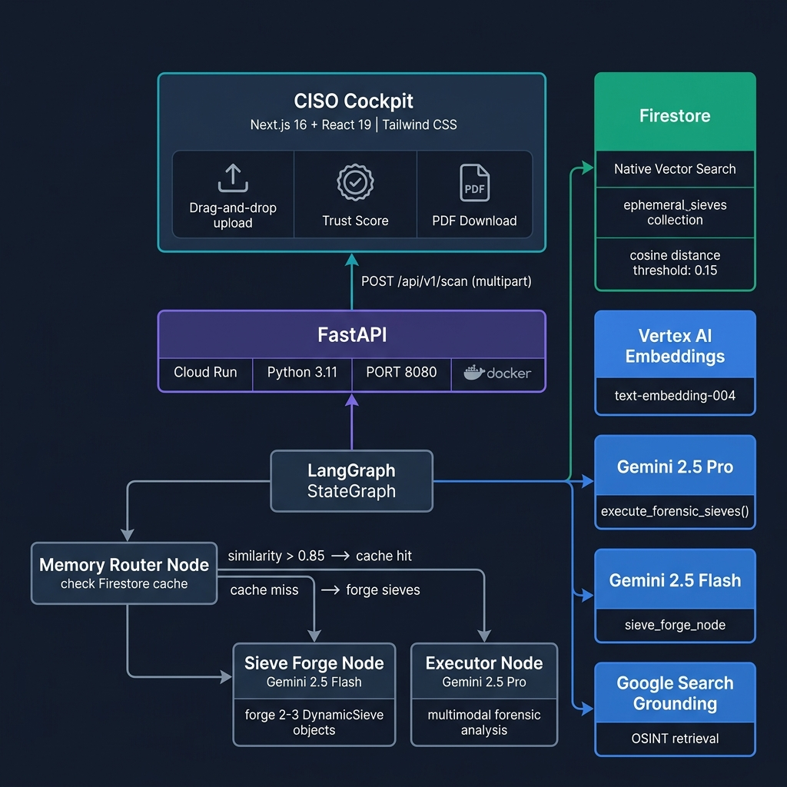
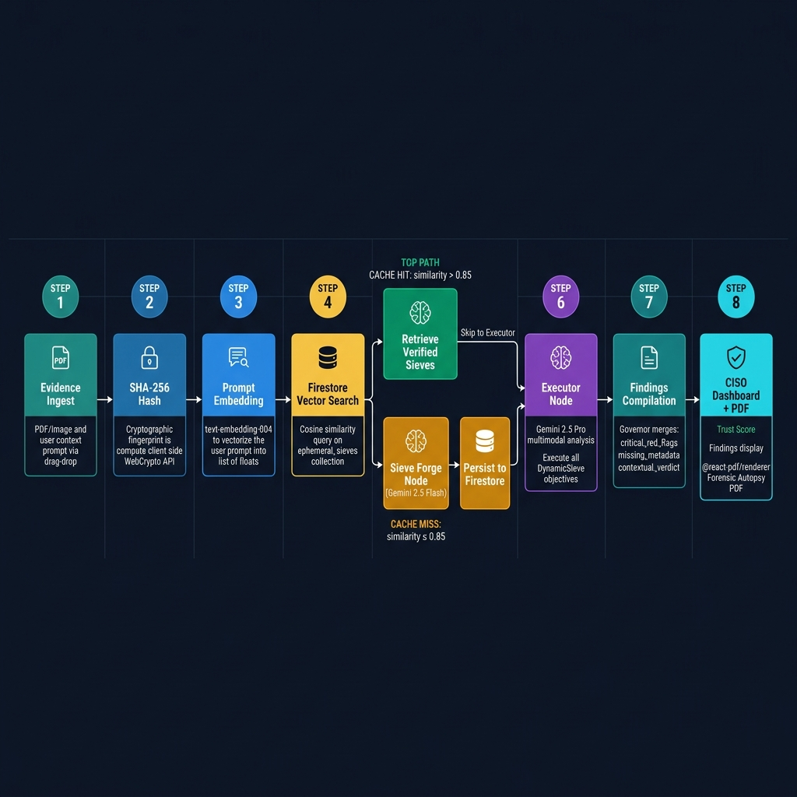
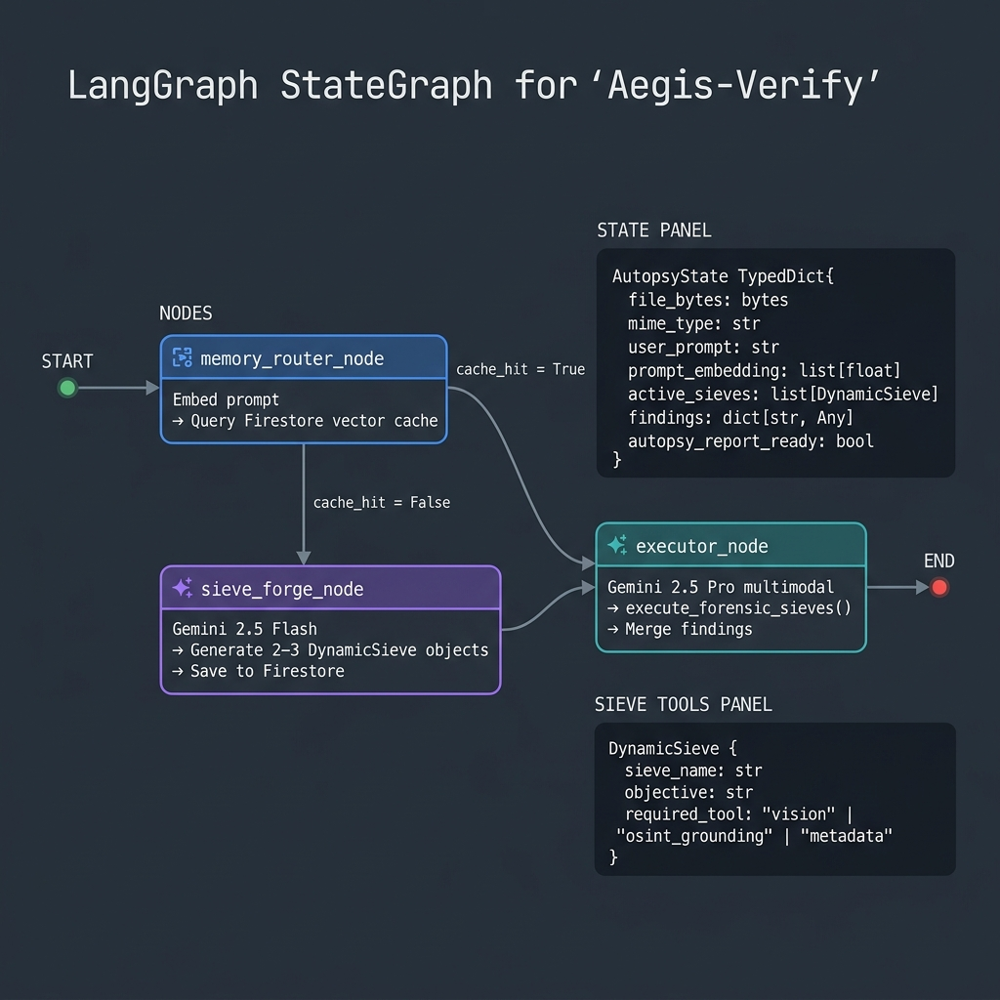

# 🛡️ Aegis-Verify — Forensic Autopsy Pipeline

> **Domain-Aware, Autonomous Digital Asset Forensics Engine**  
> Built for the **Google Solution Challenge 2026** · Powered by **Vertex AI + LangGraph + Firestore**

[](./backend)
[](./frontend)
[](https://cloud.google.com/vertex-ai)
[](./deploy.sh)

---

## The Problem — The Visibility Gap & Alert Fatigue

The proliferation of Generative AI has eroded digital trust. Enterprises, media organizations, and legal institutions face an unprecedented volume of sophisticated digital manipulation — deepfakes, forged contracts, synthetic media. Current detection approaches suffer from three fatal flaws:

- **Probabilistic "Black Boxes":** Generic likelihood scores without explainable proof are inadequate for legal or high-stakes audit contexts.
- **Alert Fatigue:** Uncontextualized anomaly flags overwhelm security teams, increasing the chance true threats are ignored.
- **Static Rigidity:** Rule-based detectors cannot dynamically adapt to novel document types or domains.

---

## Our Solution — Aegis-Verify

Instead of a single "trust score," Aegis-Verify produces a **Cryptographic Forensic Autopsy Report**: a human- and legally-readable artifact that records every test performed, all deterministic proofs (SHA-256 hashes, metadata), and LLM-guided findings.

| Attribute | Description |
|---|---|
| **Context-Driven** | User supplies a prompt (e.g., "Audit this insurance claim") which guides the entire investigation |
| **Ephemeral Sieve Forge** | Dynamically invents and deploys custom forensic tests (Sieves) tailored to the specific asset |
| **Neuro-Symbolic** | Combines probabilistic LLM analysis (Gemini 2.5 Pro) with deterministic math (SHA-256, EXIF, metadata) |
| **Grounded OSINT** | Vertex AI Grounding (Google Search) cross-checks claims against live web evidence |
| **Self-Learning** | Verified sieves are vectorized and cached in Firestore — future similar cases skip the LLM entirely |

---

## System Architecture



The architecture follows a strict **Google-Native** stack: the Next.js CISO Cockpit calls the FastAPI backend (Cloud Run), which hands off to the LangGraph StateGraph. The graph's Memory Router checks Firestore's Native Vector Search — on a cache hit it retrieves proven sieves in sub-second; on a miss it calls Gemini 2.5 Flash to forge new sieves, then invokes Gemini 2.5 Pro to execute the full forensic analysis.

### Component Overview

```
Browser (CISO Cockpit)
    └── POST /api/v1/scan (multipart: file + user_prompt)
            └── FastAPI [Cloud Run · Python 3.11 · PORT 8080]
                    └── LangGraph StateGraph
                            ├── memory_router_node → Vertex AI text-embedding-004 + Firestore vector search
                            ├── sieve_forge_node   → Gemini 2.5 Flash (cache miss path)
                            └── executor_node      → Gemini 2.5 Pro multimodal (all paths)
                                    └── findings JSON → Dashboard + @react-pdf/renderer PDF
```

---

## Forensic Pipeline — Data Flow



### Step-by-Step Flow

1. **Evidence Ingest** — User drags & drops a file (PDF/image) and supplies a context prompt
2. **SHA-256 Hash** — Client-side WebCrypto API computes the cryptographic fingerprint (immutability proof)
3. **Prompt Embedding** — `text-embedding-004` vectorizes the user prompt into a `list[float]`
4. **Firestore Vector Search** — Cosine similarity query on the `ephemeral_sieves` collection
5. **Branch Decision:**
   - **Cache Hit** (similarity > 0.85): retrieve pre-verified sieves from the Recursive Sieve Vault (sub-second, zero LLM cost)
   - **Cache Miss** (similarity ≤ 0.85): Gemini 2.5 Flash forges 2–3 custom `DynamicSieve` objects and persists them
6. **Executor Node** — Gemini 2.5 Pro runs multimodal forensic analysis using the active sieves
7. **Findings Compilation** — LangGraph Governor merges `critical_red_flags`, `missing_metadata`, `contextual_verdict`
8. **Dashboard + PDF** — Trust Score badge rendered; `@react-pdf/renderer` generates the Forensic Autopsy PDF

---

## LangGraph State Machine



```python
# AutopsyState — the typed contract flowing through every LangGraph node
class AutopsyState(TypedDict):
    file_bytes: bytes
    mime_type: str
    user_prompt: str
    prompt_embedding: list[float]
    active_sieves: list[DynamicSieve]   # forged or retrieved
    findings: dict[str, Any]            # merged across nodes
    autopsy_report_ready: bool

# DynamicSieve — the forensic test unit
class DynamicSieve(TypedDict):
    sieve_name: str
    objective: str
    required_tool: str  # "vision" | "osint_grounding" | "metadata"
```

**Graph edges:**
```
START → memory_router_node
memory_router_node → executor_node      [cache_hit = True]
memory_router_node → sieve_forge_node   [cache_hit = False]
sieve_forge_node   → executor_node
executor_node      → END
```

---

## Live Screenshots

### CISO Dashboard — Sieve Pulse & Results

The CISO Dashboard displays real-time forensic analysis output, including active sieves, SHA-256 hash, contextual verdict with Trust Score badge, and the findings JSON panel.

> **Sieve Pulse Panel** — shows `SCAN STATUS`, `REPORT READINESS`, `SHA-256 HASH`, `CONTEXTUAL VERDICT` with Trust Score, `ACTIVE SIEVES`, and raw `FINDINGS` JSON.

**Trust Score Levels:**

| Score | Level | Condition |
|---|---|---|
| 100% ✅ | **Clean** | Zero red flags detected |
| 75% 🟡 | **Mostly Safe** | <1 flag per sieve on average |
| 55% 🟠 | **Caution** | 1–2 flags per sieve |
| 25% 🔴 | **Suspicious** | >2 flags per sieve |

### Contextual Verdict Modal

The **Full Analysis** modal surfaces the complete `contextual_verdict` string from Gemini 2.5 Pro — a natural-language forensic narrative that directly addresses the user's original prompt, followed by the final verdict and Trust Score.

*Example output for a medical report:*
> "I have reviewed the medical report from MAX Lab you provided to check its genuineness. The document shows a Random Blood Sugar test result from April 3, 2023... The document is critically deficient as it is missing all essential patient-identifying information... Therefore, the forensic verdict is that the document is not authentic as a patient's medical record."
> **Trust Score: 40% — CAUTION**

---

## Deployment Commander v2.0

The `deploy.sh` script provides an interactive btop-style TUI for deploying both services.

```
╭──────────────────────────────────────────────────────────╮
│  🛡️  AEGIS-VERIFY :: DEPLOYMENT COMMANDER v2.0           │
├──────────────────────────────────────────────────────────┤
│  Select target architecture to provision:                │
│                                                          │
│[1] 🌐 Vercel       (Frontend UI)                         │
│  [2] ☁️  Cloud Run    (Backend Engine)                    │
│  [3] 🚀 SYNC          (Split-Screen Dual Deploy)          │
│  [4] ❌ Abort         (Exit)                              │
╰──────────────────────────────────────────────────────────╯
```

**Option 3 — SYNC** launches a tmux split-screen session running Vercel and Cloud Run deployments simultaneously in side-by-side panes. Falls back to parallel background processes with colored prefixes if tmux is unavailable.

### Deployment Targets

| Option | Service | Command |
|---|---|---|
| `[1]` Vercel | Frontend (Next.js) | `npx vercel --prod --yes` |
| `[2]` Cloud Run | Backend (FastAPI) | `gcloud run deploy aegis-backend --source . --region us-central1` |
| `[3]` SYNC | Both simultaneously | tmux split-screen, left pane = Vercel, right pane = Cloud Run |

### Live Deployment

Both services deploy simultaneously in a tmux split:
- **Left pane `[ 🌐 VERCEL DEPLOYMENT ]`**: Next.js build → Vercel production URL
- **Right pane `[ ☁️ GCP CLOUD RUN DEPLOYMENT ]`**: Docker build → Cloud Run service `aegis-backend`

**Deployed URLs:**
- **Frontend:** `https://aegis-verify-ui-kez7fwqjb-pswaikar1742-gmailcoms-projects.vercel.app`
- **Backend:** `https://aegis-backend-*.run.app` (Cloud Run, `us-central1`)

---

## Quick Start (Local Development)

### Prerequisites

- Python 3.11+ with virtualenv
- Node.js 18+ / npm 9+
- Google Cloud credentials with Vertex AI + Firestore permissions
- GCP project with `GCP_PROJECT_ID=aegis-verify-2026`

### Backend (FastAPI)

```bash
cd backend
python -m venv venv && source venv/bin/activate
pip install -r requirements.txt

# Set environment variables
export GCP_PROJECT_ID="aegis-verify-2026"
export GCP_REGION="us-central1"
export CORS_ORIGINS='["http://localhost:3000"]'

# Run dev server
uvicorn main:app --reload --host 0.0.0.0 --port 8000
```

Or via `.env` file (see `backend/.env`):
```env
GCP_PROJECT_ID="aegis-verify-2026"
GCP_REGION="us-central1"
CORS_ORIGINS='["http://localhost:3000"]'
```

### Frontend (Next.js)

```bash
cd frontend
npm install
npm run dev
# Open http://localhost:3000
```

> **Note:** The frontend hardcodes `http://localhost:8000/api/v1/scan` for local development. Update this to the Cloud Run URL for production.

### One-Command Deploy

```bash
chmod +x deploy.sh
./deploy.sh
# Select [3] SYNC for simultaneous Vercel + Cloud Run deployment
```

---

## API Reference

### `POST /api/v1/scan`

Accepts multipart form data. Runs the full LangGraph autopsy pipeline.

**Request:**
```bash
curl -X POST "http://localhost:8000/api/v1/scan" \
  -F "file=@/path/to/evidence.pdf" \
  -F "user_prompt=Audit this medical report for authenticity and missing patient data"
```

**Response:**
```json
{
  "status": "success",
  "message": "Scan request completed",
  "filename": "evidence.pdf",
  "autopsy_report_ready": true,
  "active_sieves": [
    {
      "sieve_name": "DocumentMetadataVerification",
      "objective": "Extract and analyze metadata from the medical report to identify inconsistencies in creation date, author, or modification history that might suggest inauthenticity.",
      "required_tool": "metadata"
    }
  ],
  "findings": {
    "cache_hit": true,
    "cache_distance": 0.007283135771109839,
    "critical_red_flags": ["The document is missing all patient-identifying information..."],
    "missing_metadata": ["Patient Name", "Age/Gender", "MaxID/Lab ID"],
    "contextual_verdict": "I have reviewed the medical report...",
    "executor_status": "completed"
  }
}
```

**Key findings fields:**

| Field | Type | Description |
|---|---|---|
| `cache_hit` | bool | Whether sieves were retrieved from Firestore (vs. freshly forged) |
| `cache_distance` | float | Cosine distance from nearest cached embedding (lower = closer match) |
| `critical_red_flags` | `string[]` | Forensic anomalies detected by the active sieves |
| `missing_metadata` | `string[]` | Required fields absent from the document |
| `contextual_verdict` | string | Gemini 2.5 Pro narrative verdict addressing the user's prompt |
| `executor_status` | string | `"completed"` or `"failed"` |

---

## Technology Stack

### Frontend — CISO Cockpit

| Technology | Version | Role |
|---|---|---|
| Next.js | 16.2.4 | App Router, SSR, routing |
| React | 19.2.4 | UI framework |
| TypeScript | 5.x | Type safety |
| Tailwind CSS | 4.x | Utility-first styling |
| `@react-pdf/renderer` | 4.5.1 | On-demand Forensic Autopsy PDF generation |
| `react-dropzone` | 15.x | Drag-and-drop evidence intake |
| WebCrypto API | native | SHA-256 client-side hashing |

### Backend — Intelligence Engine

| Technology | Version | Role |
|---|---|---|
| Python | 3.11+ | Runtime |
| FastAPI | 0.115.0 | REST API, CORS middleware |
| LangGraph | 1.0.10 | StateGraph orchestration |
| Pydantic | 2.12.5 | Settings, validation |
| uvicorn | 0.30.6 | ASGI server |
| Docker | python:3.11 | Containerization for Cloud Run |

### AI & Memory — Google-Native

| Service | Model / Version | Role |
|---|---|---|
| Vertex AI | Gemini 2.5 Pro | Multimodal forensic executor (`execute_forensic_sieves`) |
| Vertex AI | Gemini 2.5 Flash | Ephemeral sieve forging (`sieve_forge_node`) |
| Vertex AI | `text-embedding-004` | Prompt vectorization for cache lookup |
| Vertex AI | Google Search Grounding | Live OSINT retrieval (prepared, SDK-guarded) |
| Firestore | Native Vector Search | Recursive Sieve Vault — `ephemeral_sieves` collection |

### Infrastructure

| Service | Role |
|---|---|
| Vercel | Frontend hosting (Next.js production build) |
| Google Cloud Run | Backend hosting (auto-scales 0→N, 1Gi memory) |
| Google Artifact Registry | Docker image storage (via `gcloud run deploy --source`) |

---

## Project Structure

```
aegis-verify/
│
├── frontend/                          # Next.js CISO Cockpit
│   ├── app/
│   │   ├── layout.tsx                 # Root layout (Geist fonts)
│   │   ├── page.tsx                   # CISO Dashboard (drag-drop, trust score, findings)
│   │   └── globals.css                # Tailwind CSS v4 + CSS variables
│   ├── components/
│   │   └── AutopsyReport.tsx          # PDF generation (@react-pdf/renderer)
│   └── package.json                   # next 16, react 19, @react-pdf/renderer 4.5.1
│
├── backend/                           # FastAPI + LangGraph
│   ├── main.py                        # POST /api/v1/scan endpoint + CORS
│   ├── core/
│   │   ├── config.py                  # Pydantic BaseSettings (fail-fast)
│   │   └── graph.py                   # LangGraph StateGraph (3 nodes)
│   ├── services/
│   │   ├── vertex_llm.py              # VertexLLMService (Gemini 2.5 Pro/Flash)
│   │   └── firestore_db.py            # FirestoreSieveStore (vector search + save)
│   ├── Dockerfile                     # python:3.11, PORT 8080
│   └── requirements.txt               # fastapi, langgraph, google-cloud-*
│
├── docs/                              # Architecture diagrams & screenshots
│   ├── system_architecture.png
│   ├── forensic_pipeline.png
│   └── langgraph_state_machine.png
│
├── deploy.sh                          # Deployment Commander v2.0 (Vercel + Cloud Run)
├── README.md                          # This file
├── architecture.md                    # Tech stack & state machine reference
├── context.md                         # Mission context & constraints
├── current_code.md                    # Full code snapshot (gitignored)
└── logs.md                            # Development work log (gitignored)
```

---

## Environment & Secrets

```bash
# backend/.env (not tracked by git)
GCP_PROJECT_ID="aegis-verify-2026"
GCP_REGION="us-central1"
CORS_ORIGINS='["http://localhost:3000"]'
```

- `GOOGLE_APPLICATION_CREDENTIALS` — path to GCP service account JSON (for local dev)
- `GCP_PROJECT_ID` — GCP project for Vertex AI + Firestore
- `GCP_REGION` — defaults to `us-central1`
- `CORS_ORIGINS` — comma-separated list of allowed origins

For Cloud Run, env vars are injected via `--set-env-vars` in `deploy.sh`.

---

## Use Cases

### Insurance Fraud Detection
Upload a crash photo with prompt *"Verify this insurance claim for location inconsistency"*. The system generates Geolocation and EXIF Camera Metadata sieves, extracts hidden GPS coordinates, and proves the photo location is inconsistent with the claimed accident site.

### Corporate Document Fraud
Upload a vendor invoice with prompt *"Verify vendor legitimacy"*. System constructs OSINT sieves, uses Vertex Grounding to check domain registration and corporate records, and flags shell companies or recently-registered domains.

### Medical Report Verification
Upload a medical PDF with prompt *"Check this report for authenticity"*. The DocumentMetadataVerification sieve extracts metadata, flags missing patient-identifying fields, and delivers a 40% Trust Score — **CAUTION**.

---

## Developer Tips

- **Vertex call failures:** Confirm `GOOGLE_APPLICATION_CREDENTIALS` and `GCP_PROJECT_ID` are set; verify service account has `Vertex AI User` + `Firestore User` roles.
- **Firestore cache issues:** Check `ephemeral_sieves` collection in Firestore console; the cosine distance threshold is `0.15` — lower = stricter cache matching.
- **Google Search Grounding:** Currently SDK-guarded behind `hasattr(Tool, "from_google_search")` for Gemini 2.5+ compatibility. Tools commented out in `execute_forensic_sieves()` pending SDK version alignment.
- **PDF not rendering:** Ensure `autopsy_report_ready = true` and all three fields (`critical_red_flags`, `missing_metadata`, `contextual_verdict`) are non-null strings/arrays in `findings`.
- **Local reload:** Use `uvicorn main:app --reload` for live backend changes.

---

## Contributing

```bash
git checkout -b feat/your-change
# implement
git add .
git commit -m "feat: description"
git push origin feat/your-change
# open PR
```

---

## License

No license file is currently present. Add a `LICENSE` at the repo root before public release.

---

*Aegis-Verify — Autonomous Digital Asset Forensics · Google Solution Challenge 2026*
